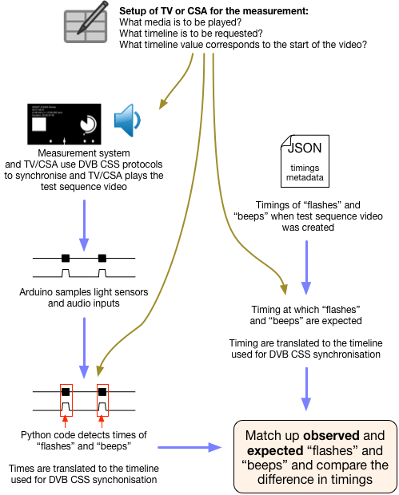
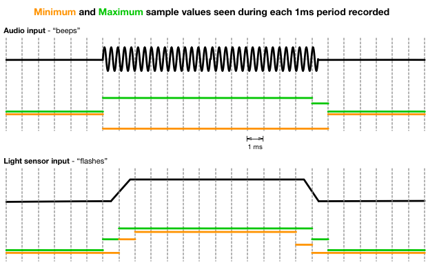
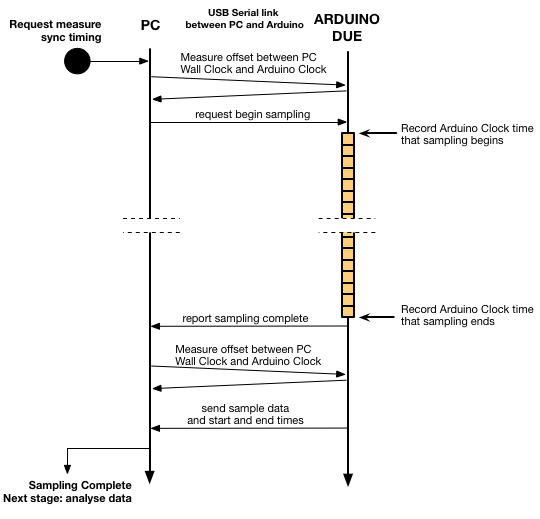
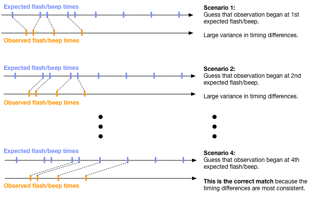

# Design Overview

See also:
* the [README](../README.md) in the [project root](../) folder for instructions
  on getting started and how to run the measurement system.
* the [README](../test_sequence_gen/README.md) in the
  [test_sequence_gen](../test_sequence_gen) folder for information on the video
  test sequence generation code.
* the [README](../hardware/README.md) in the [hardware](../hardware) folder for
  information on the sensor hardware design.

## Sequence of events

### When measuring a CSA

[exampleCsaTester.py](../src/exampleCsaTester.py) does the following:

1. The system begins to pretend to be the TV Device.

   * It starts server tasks for three of the DVB synchronisation protocols:
     CSS-CII, CSS-TS and CSS-WC.

   * It pretends to be playing content with a timeline. Initially pretending
     that it is paused.
     
   * It now waits to be told to start by the operator.
     
2. At this point the CSA to be measured connects to the measurement system and
   can start synchronising.
   
3. The operator tells the measurement system to start.

   * The timeline is un-paused
   
   * The system waits a few seconds to give the CSA time to respond.
     (the timeline is still "playing")
   
   * The measurement system records data from the light sensors
     and/or audio inputs (using the microcontroller) then transfers the data
     to the PC part of the system.
   
   * The relative positions of the timeline and wall clock are noted both 
     before and after data recording, because this is needed during analysis.
     
4. Once measurement is complete, the system can analyse the results.

   * The operator types in the worst-case dispersion of the CSA's wall clock
     so it can be taken into account.

   * It analyses the measurements and reports the results.

### When measuring a TV Device

[exampleTVTester.py](../src/exampleTVTester.py) does the following:

1. The system begins to pretend to be the CSA.

   * It acts as a client, synchronising its local wall clock to that of the TV
     via CSS-WC and synchronising to a timeline via CSS-TS.

   * It then waits and confirms that timeline synchronisation is working
     and that the wall clock is synchronising with not too high a dispersion.

2. Measurement begins. The measurement system records the following:

   * hanges in dispersion of the wall clock (this changes after every
     adjustment made by the CSS-WC client in the measurement system).

   * Control Timestamps received from the TV via CSS-TS.

   * Data from the light sensors and/or audio inputs (using the microcontroller)
     which is then transfered to the PC when measurement completes.

4. Once measurement is complete, the system can analyse the results.

   * The recorded wall clock dispersions and Control Timestamps are
     used to reconstruct, for any time during the measurement process:
     
       * what the dispersion (uncertainty) the wall clock of the
         measurement system had,
       * what wall clock time corresponded to what synchronisation timeline time.

   * Along with the measurmeents, these reconstructions are fed into
     the analysis process.

   * The results are reported.

## How are measurements recorded and analysed?

The processes happening in order to take a measurement of sync timing are 
illustrated in simplified form below:

  

### Why use an external microcontroller?

The observations of light and sound need to be fast and made at known times
that software on the PC can relate to the 'wall clock' used in the DVB CSS
protocols.

PC audio input and output, or video frame grabbers, have buffering in both
the software stacks and in the hardware. PC code has no idea how long ago the
data was captured that it has just been passed.

An embedded microcontroller has little or no operating system, no pre-emptive
multitasking that could interrupt measurements taking place, and direct
access to hardware (such as analog to digital converters) with predictable
and minimal latencies (of the order of microseconds).

### How is data sampled?

The Arduino can record samples from up to 4 analog inputs (up to two light
sensors and two channels of audio input). Because memory is limited
(96kbytes) the data is chunked into 1 millisecond long periods. For each
period, the Arduino records the lowest and highest values sampled from each
ADC during that period.

  

The Arduino code also records the time (of the Arduino's timer) when sampling
began and finished, allowing the start and end of each period to be
calculated. This timing is accurate to within a few tens of microseconds or
better.

An Arduino Due was used instead of the most common Arduino because it has
much more memory and can sample data faster. Even so, the maximum length of
the sampling period is limited by the available memory:

* 11.2 seconds for 4 inputs
* 15.3 seconds for 3 inputs
* 23.0 seconds for 2 inputs
* 46.0 seconds for 1 input

### How is the data uploaded from Arduino to PC?

The measurement process involves the following interactions between the PC
and the Arduino:

  

Once sampling is complete the sample data (the minimum and maximum values
seen during each 1 millisecond period) are uploaded via USB to the PC.

Immediately before and after sampling, the PC attempts to synchronise its
clock to that of the Arduino by using a very simple request-response message
exchange, similar to that of NTP.

This allows the PC to know the relationship between its Wall Clock that it is
using for the DVB CSS protocols, and the clock of the Arduino.

### How are the samples translated into timings of beeps/flashes?

That way, the PC can translate the start and end times from Arduino clock
times to that of a clock on the PC (such as the DVB CSS "wall clock"). The PC
code can therefore calculate the start time of each period of sample
data.

The data is then prepared for processing by a pulse detector that determines
the timing of the middle of each flash or beep:

* For *audio data*, the envelope (the difference between minimum and maximum values)
seen during each sample period is fed into the detector code.

* For *light sensor data*, the maximum values seen in each sample period are
fed into the detector code.

  

The detector code examines the supplied data and uses a simple threshold
based method to detect rising and falling edges in the data. The mid point
between the rising and falling edges is considered to be the time of (the
middle of) the flash or beep.

The detector code applies a small amount of hold time (1ms for beeps, 4ms for
flashes). If a falling edge is detected but the data rises again after less
than the hold time, then the falling edge is considered spurious (e.g. due to
backlight modulation) and is ignored.

### How are observed timings translated to be on the DVB CSS timeline?

The measurement system uses the DVB CSS protocols to work with the device
whose timing is being measured (TV Device or CSA). It therefore has an
understanding of how a timeline for media relates to Wall Clock time and how
Wall Clock time relates to system timers on the PC the measurement system
software is running on.

* **When measuring a CSA** the measurement system pretends to be the TV and
  controls the synchronisation timeline, measuring if the CSA's output (from
  its display and speakers) is synchronised correctly to the timeline.
  
* **When measuring a TV** the measurement system pretends to be a CSA and if
  the timestamps being sent out by the TV accurately represent what the TV is
  outputting (via its display and speakers).

When synchronising time with the Arduino it does so in terms of
its model of the Wall Clock - converting the timing of sampling to be in
terms of the Wall Clock. Using its understanding of the relationship between
Wall Clock and Synchornisation Timeline it can then do another conversion to
get from Wall Clock times to times on the timeline being conveyed using the
CSS-TS protocol.

   

* Arduino Time is determined by the request-response message exchanges done
  just before and after sampling.
* Wall Clock time is shared between the TV Device and CSA using the CSS-WC
  DVB protocol.
* The timeline for the media is shared between the TV Device and CSA using the
  CSS-TS protocol.

Given knowledge of how times map during sampling, the code can
interpolate any time in-between. The error bounds (e.g. dispersion) known at
both before and after times can also be interpolated.

When the measurement system is running in the role of a TV Device, it
implements the DVB CSS protocols as a server. It provides a Wall Clock that
the CSA can synchronise to via the CSS-WC protocol, and pretends to be
playing media - by providing a timeline via CSS-TS that the CSA can also
synchronise to.  The choice of timeline that the measurement system provides
is set using command line options.

* The measurement system notes the relationship between Wall Clock and
  Synchronisation Timeline (beacause it controls it).

When the measurement system is running in the role of a CSA, it acts as a
client, synchronising to the wall clock provided by the TV Device via the
CSS-WC protocol, and synchronising to a timeline provided by the TV Device
via the CSS-TS protocol. It uses the CSS-CII protocol to obtain the URLs at
which the TV Device is serving the CSS-WC and CSS-TS protocols. The choice of
timeline that the measurement tries to use is set using command line options.

* It logs all the Control Timestamps it receives via CSS-TS so that it can
  reconstruct its understanding of how to convert between wall clock and
  synchronisation timeline time at any point during the measurment period.

### Quantifying measurement error

For each detected timing of a flash/beep, an error bound is calculated.
This is the sum of:
* the uncertainty in estimating the Arduino's clock (+/- 0.5*round-trip-time)
* the precision of Arduino Clock measurements (+/- 1 us)
* the precision of Wall Clock measurements
* the precision of Synchronisation Timeline (+/- 0.5/tickRate)
* the potential error in the Wall Clock synchronisation (+/- maximum dispersion)
* the fact that sample data is recorded in 1ms chunks (+/- 0.5ms)

It is expected that this will be dominated by the dispersion of the wall clock
estimate.

When the measurement system is pretending to be a CSA it records dispersion
of the Wall Clock (the potential error) during the measurement period. It does
so by listening for changes reported by the algorithm for clock synchronisation
used within its Wall Clock protocol Client.

### How are the detected flashes/beeps matched up with the video sequence?

In the test video sequence, the pattern of timings between one flash/beep and
the next is arranged such that the pattern of any observed sequence (of
sufficient duration) will not match the pattern seen anywhere else in the
video. The observed sequence of flashes/beeps can therefore be matched to
where it came from within the test video sequence, even if the TV/CSA was
ahead or behind by several seconds.

When the test video sequence is generated, there is also a JSON metadata file
that includes a list of the times at which the flashes/beeps occur.

The analysis code translates these timings to also be on the timeline, using
the information supplied about the choice of timeline, its tick rate, and
what timeline value corresponds to the start of the video.

The set of observed timings of flashes/beeps are then compared against this
using a correlation algorithm. It is assumed that no flashes or beeps are
missed during the period of measurement.

The correlation algorithm tries each possible scenario - whether the first
flash/beep observed corresponded to the first in the sequence, or the second,
or the third etc. If there are *N* observed beeps/flashes and *M*
beeps/flashes in the whole test video sequence, then there are *M-N*
scenarios to try.

  

For each scenario, the difference between each expected and observed timing
is then calculated. If the difference is relatively constant, from one to the
next, then this indicates that the pattern of flashes/beeps matches well.
However, if it varies from one flash/beep to the next then it is probably a
mismatch. The quality of match is determined by calculating the statistical
variance of the timing differences. The scenario with the lowest variance is
considered the match.

The average difference between expected and observed flash/beep timings (for
the best matching scenario) indicates how early or late the TV/CSA is
presenting its audio and video.

To determine if the TV/CSA has met a particular accuracy requirement (e.g.
+/- 10ms) the difference between expected and observed timing is checked for
each individual observed flash/beep. If any observed timing difference is
greater than the accuracy requirement plus the error bound for that
observation, then the timing does not meet the accuracy requirement.

The error bound on the timing of each detected flash/beep is, effectively,
the margin for giving the TV/CSA the "benefit of the doubt". This is because
the error bounds reflect the uncertainty in the measurement process and the
limits on achievable synchronisation due to current network conditions.

